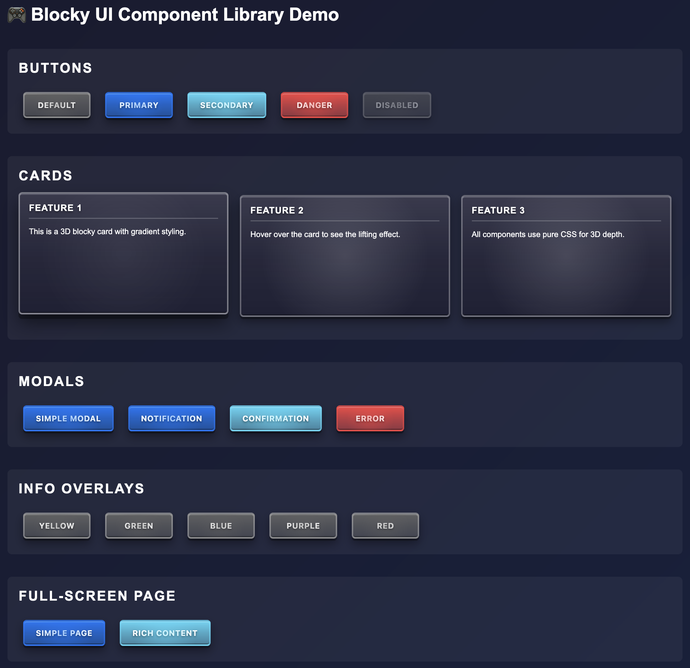

# [Blocky UI](https://raw-fun-gaming.github.io/blocky-ui/) &middot; [](https://www.npmjs.com/package/blocky-ui-lite) [](https://github.com/raw-fun-gaming/blocky-ui/actions) [](https://bundlephobia.com/package/blocky-ui-lite) [](LICENSE)

A lightweight, 3D blocky-themed UI component library built with TypeScript and pure CSS.

[Live Demo](https://raw-fun-gaming.github.io/blocky-ui/) · [Documentation](https://raw-fun-gaming.github.io/blocky-ui/docs/)



## 🚀 Motivation

Inspired by the multiplier tags in Stack Rush, I wanted to create a lightweight UI library that brings that distinctive 3D blocky aesthetic to any web project. Unlike heavy framework-dependent UI libraries, Blocky UI is:

- **Zero Framework Dependencies** - Works with vanilla JavaScript/TypeScript
- **Pure CSS Effects** - Multi-layer box shadows for authentic 3D depth
- **Game-Ready** - Optimized for interactive applications and games
- **Self-Contained** - Single CSS file + TypeScript class, minimal build process

## ✨ Features

- **🎮 3D Blocky Aesthetic**: Multi-layer box shadows creating realistic 3D depth
- **🎨 Pure CSS Styling**: No SVG generation, hardware-accelerated rendering
- **🎭 Theme Support**: Built-in themes (blocky, fall-guys) with easy customization
- **📦 Zero Dependencies**: Pure TypeScript/JavaScript with no external dependencies
- **💪 Full TypeScript Support**: Complete type safety with comprehensive interfaces
- **📱 Responsive Design**: Mobile-first approach with adaptive breakpoints
- **⚡ Lightweight & Fast**: Minimal bundle size, optimized for 60fps animations
- **🔧 Framework-Agnostic**: Works with React, Vue, Svelte, or vanilla JS

## Installation

```bash
npm install blocky-ui-lite
```

## Usage

```typescript
import { BlockyUI } from 'blocky-ui-lite';
import 'blocky-ui-lite/styles';

// Set a theme (optional - defaults to 'blocky')
BlockyUI.setTheme('fall-guys'); // or 'blocky' for default theme

// Create a button
const button = BlockyUI.createButton({
  text: 'Click Me',
  variant: 'primary',
  onClick: () => console.log('Clicked!')
});

document.body.appendChild(button);

// Create and show a modal
const modal = BlockyUI.createModal({
  title: 'Welcome',
  content: 'This is a blocky modal!',
  buttons: [
    { text: 'OK', variant: 'primary', onClick: () => {} }
  ]
});

modal.show();  // Show the modal
// modal.close();  // Close programmatically

// Convenience methods for common modal types
BlockyUI.createNotification('Success!', 'Operation completed.').show();
BlockyUI.createError('Error!', 'Something went wrong.').show();

const confirmModal = BlockyUI.createConfirmation(
  'Confirm Action',
  'Are you sure?',
  () => console.log('Confirmed'),
  () => console.log('Cancelled')
);
confirmModal.show();
```

## 📦 Components

### Interactive Components
- **[BlockyButton](https://raw-fun-gaming.github.io/blocky-ui/docs/components#blockybutton)** - 4 variants with 3D hover effects
- **[BlockyDropdown](https://raw-fun-gaming.github.io/blocky-ui/docs/components#blockydropdown)** - Theme-aware dropdowns with 4 variants and custom arrow
- **[BlockyModal](https://raw-fun-gaming.github.io/blocky-ui/docs/components#blockymodal)** - Full-featured modals with backdrop blur and animations

### Display Components
- **[BlockyCard](https://raw-fun-gaming.github.io/blocky-ui/docs/components#blockycard)** - Content containers with 3D styling
- **[BlockyInfo](https://raw-fun-gaming.github.io/blocky-ui/docs/components#blockyinfo)** - Overlay popups with 5 color themes (yellow, green, blue, purple, red)
- **[BlockyTag](https://raw-fun-gaming.github.io/blocky-ui/docs/components#blockytag)** - Status/location tags with gradient styling
- **[BlockyPage](https://raw-fun-gaming.github.io/blocky-ui/docs/components#blockypage)** - Full-screen pages with animated gradient borders (7 color sets) and optional auto-hide scrollbar

### Utility Components
- **Error Dialogs** - Pre-configured error modals
- **Confirmation Dialogs** - Yes/No confirmation modals
- **Notifications** - Toast-style notifications

## 🎭 Themes

Blocky UI supports multiple themes out of the box. Switch themes at runtime with a single line of code:

```typescript
import { BlockyUI } from 'blocky-ui-lite';

// Switch to Fall Guys theme (bright, playful cartoon style)
BlockyUI.setTheme('fall-guys');

// Switch back to default blocky theme
BlockyUI.setTheme('blocky');
```

### Available Themes

| Theme | Description |
|-------|-------------|
| `blocky` | Default dark theme with deep shadows and purple accents |
| `fall-guys` | Bright, playful cartoon style with cyan backgrounds, solid black shadows, purple headers, and rounded corners |

### Theme Features

**Fall Guys Theme** includes:
- Light cyan (`#64d4ff`) backgrounds
- Solid black drop shadows (no transparency)
- Purple gradient headers with white text
- White borders on components
- More rounded corners (16-20px)
- Playful, cartoon-like aesthetic

## Styling

Blocky UI uses pure CSS with 3D box-shadow effects, gradient backgrounds, and smooth transitions. All components feature:

- 3D depth with multi-layer box shadows
- Smooth hover and active state animations
- Gradient backgrounds with radial overlays
- Responsive breakpoints for all screen sizes
- Customizable color variants
- Theme-based styling via `data-blocky-theme` attribute

## 🎨 Visual Design

The components feature:
- **Multi-layer box shadows** creating authentic 3D depth
- **Gradient backgrounds** with radial overlays for richness
- **Smooth hover animations** with Y-axis transforms
- **Backdrop blur** for modern glassmorphism effects
- **Responsive scaling** for different screen sizes
- **Customizable color variants** via CSS custom properties

## 📖 Documentation

### Quick Links
- 🏠 **[Documentation Home](https://raw-fun-gaming.github.io/blocky-ui/docs/)** - Complete documentation
- 🚀 **[Installation & Setup](https://raw-fun-gaming.github.io/blocky-ui/docs/installation)** - Get started quickly
- 📚 **[Component Reference](https://raw-fun-gaming.github.io/blocky-ui/docs/components)** - Full API documentation
- 💡 **[Complete Examples](https://raw-fun-gaming.github.io/blocky-ui/docs/examples)** - Real-world examples
- 🎨 **[Themes](https://raw-fun-gaming.github.io/blocky-ui/docs/themes/)** - Theme design specs

## 🎮 Perfect for Games

- **No Framework Lock-in**: Works with any game engine
- **Performance Optimized**: Pure CSS for 60fps animations
- **Memory Efficient**: Minimal memory footprint
- **Event-Driven**: Clean event handling
- **Responsive**: Adapts to different screen sizes

## 🖼️ Credits

**Design Inspiration**: [Stack Rush](https://github.com/raw-fun-gaming) multiplier tags - The distinctive 3D blocky aesthetic with multi-layer box shadows and gradient backgrounds.

## 📁 File Structure

```
blocky-ui/
├── README.md               # This file
├── package.json           # Package configuration
├── rollup.config.js       # Build configuration
├── src/                   # Source code
│   ├── index.ts           # Main entry point
│   ├── components/        # Individual component classes
│   │   ├── BlockyButton.ts
│   │   ├── BlockyModal.ts
│   │   ├── BlockyCard.ts
│   │   ├── BlockyInfo.ts
│   │   ├── BlockyTag.ts
│   │   └── BlockyPage.ts
│   ├── types/             # TypeScript definitions
│   │   └── index.ts
│   └── styles/            # CSS modules
│       ├── base/
│       │   ├── _variables.css
│       │   ├── _shared.css
│       │   └── _animations.css
│       ├── components/
│       │   ├── _button.css
│       │   ├── _modal.css
│       │   ├── _card.css
│       │   ├── _info.css
│       │   ├── _tag.css
│       │   └── _page.css
│       ├── themes/
│       │   └── _fall-guys.css  # Fall Guys theme
│       └── blocky-ui.css   # Main entry point
├── dist/                  # Built output (generated)
│   ├── index.esm.js       # ES Module build
│   ├── index.cjs.js       # CommonJS build
│   ├── index.umd.js       # UMD build
│   ├── index.d.ts         # TypeScript declarations
│   └── blocky-ui.css      # Processed styles
├── docs/                  # Documentation
│   ├── docs/              # Jekyll documentation pages
│   └── index.html         # GitHub Pages demo
└── screenshots/           # Component screenshots
```

## 🚀 Development

### Development Commands

```bash
# Install dependencies
npm install

# Build library
npm run build

# Watch mode for development
npm run dev

# Run demo server
npm run demo

# Clean build artifacts
npm run clean
```

### Contributing

Contributions welcome! Please maintain the 3D blocky aesthetic and follow the established patterns for new components.

1. Fork the repository
2. Create your feature branch (`git checkout -b feature/amazing-feature`)
3. Commit your changes (`git commit -m 'Add amazing feature'`)
4. Push to the branch (`git push origin feature/amazing-feature`)
5. Open a Pull Request

## 🔄 Version History

See [CHANGELOG.md](CHANGELOG.md) for version history and release notes.

## 📄 License

MIT © Richard Fu

---

**Built for gaming. Designed with 3D depth. 🎮**

*Star ⭐ this repo if you find it useful!*
